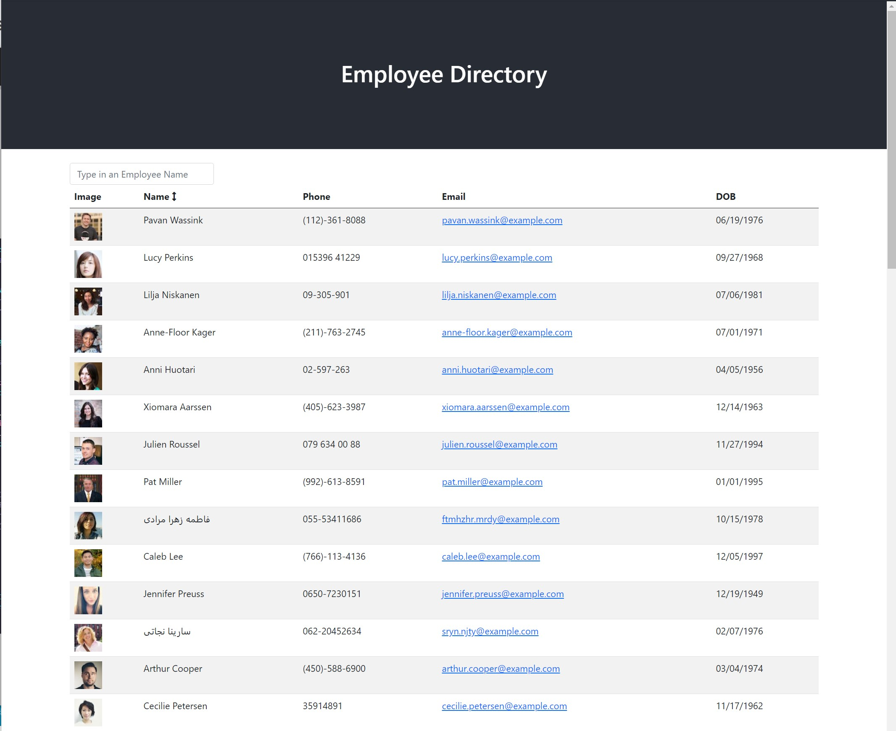

  
  # Employee Directory

  ## Description
  Use this directory to sort your employees by name in either ascending or descending order
  
  ## License Badge
  
  []
  
  ## Table of Contents
  
  - [Installation](#installation)
  - [ScreenShots](#screenshots)
  - [License](#license)
  - [Live App](#live-app)
  - [Git Hub Repo](#git-hub-repo)
  
  ## Installation
  
  Step 1: NPM Install OR run via browser
  Step 2: load in employee data
  Step 3: type in employee name to search by name
  Step 4: Sort by name alphabetically
  
 
  ## ScreenShots
  
  
  
  ## Live App
  https://adamnatrop.github.io/react_employee_directory/
  
  ## Git Hub Repo
  https://github.com/adamnatrop/react_employee_directory
  
  ## License
  
  The Unlicense
  Review License terms at [http://unlicense.org/](http://unlicense.org/)
  
  
  ## Questions
  Check out my Github for more information
  
  [ademade](https://www.github.com/ademade)
  
  

  